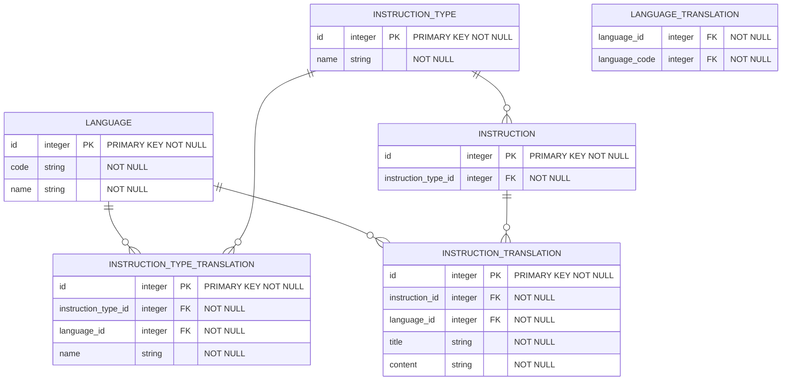

## Database


## SQLite
```sql @sqlite

PRAGMA foreign_keys = ON;
--------------------------------------------------------------------------------
CREATE TABLE IF NOT EXISTS competence_area (
  id INTEGER PRIMARY KEY NOT NULL,
  area TEXT NOT NULL,
  description TEXT NOT NULL
) STRICT;

CREATE UNIQUE INDEX IF NOT EXISTS idx_competence_area_area ON competence_area(area);

--------------------------------------------------------------------------------
CREATE TABLE IF NOT EXISTS competence (
  id INTEGER PRIMARY KEY NOT NULL,
  competence_area_id INTEGER NOT NULL REFERENCES competence_area(id),
  name TEXT NOT NULL,
  title TEXT NOT NULL,
  description TEXT NOT NULL
) STRICT;

CREATE UNIQUE INDEX IF NOT EXISTS idx_competence_name ON competence(name);

--------------------------------------------------------------------------------
CREATE TABLE IF NOT EXISTS taxonomy_level (
  id INTEGER PRIMARY KEY NOT NULL,
  level TEXT NOT NULL,
  term TEXT NOT NULL,
  description TEXT NOT NULL
) STRICT;

CREATE UNIQUE INDEX IF NOT EXISTS idx_taxonomy_level_id ON taxonomy_level(id);
--------------------------------------------------------------------------------
CREATE TABLE IF NOT EXISTS module (
  id INTEGER PRIMARY KEY NOT NULL,
  module_number INTEGER NOT NULL,
  name TEXT NOT NULL,
  type TEXT NOT NULL
) STRICT;

CREATE UNIQUE INDEX IF NOT EXISTS idx_module_id ON module(id);

--------------------------------------------------------------------------------
CREATE TABLE IF NOT EXISTS skill (
  id INTEGER PRIMARY KEY NOT NULL,
  title TEXT NOT NULL,
  description TEXT NOT NULL
) STRICT;

CREATE UNIQUE INDEX IF NOT EXISTS idx_skill_id ON skill(id);

--------------------------------------------------------------------------------
CREATE TABLE IF NOT EXISTS performance_goal (
  id INTEGER PRIMARY KEY NOT NULL,
  competence_id INTEGER NOT NULL REFERENCES competence(id),
  taxonomy_level_id INTEGER NOT NULL REFERENCES taxonomy_level(id),
  name TEXT NOT NULL,
  description TEXT NOT NULL
) STRICT;

CREATE UNIQUE INDEX IF NOT EXISTS idx_performance_goal_id ON performance_goal(id);

--------------------------------------------------------------------------------
CREATE TABLE IF NOT EXISTS task_template (
  id INTEGER PRIMARY KEY NOT NULL,
  title TEXT NOT NULL,
  description TEXT NOT NULL
) STRICT;

CREATE UNIQUE INDEX IF NOT EXISTS idx_task_template_id ON task_template(id);

--------------------------------------------------------------------------------
CREATE TABLE IF NOT EXISTS task_template_performance_goal (
  task_template_id INTEGER REFERENCES task_template(id),
  performance_goal_id INTEGER REFERENCES performance_goal(id),
  PRIMARY KEY (task_template_id, performance_goal_id)
) STRICT;

--------------------------------------------------------------------------------
CREATE TABLE IF NOT EXISTS task_template_module_skill (
  task_template_id INTEGER REFERENCES task_template(id),
  module_id INTEGER REFERENCES module(id),
  skill_id INTEGER REFERENCES skill(id),
  PRIMARY KEY (task_template_id, module_id, skill_id)
) STRICT;

--------------------------------------------------------------------------------
CREATE TABLE IF NOT EXISTS learner (
  id INTEGER PRIMARY KEY NOT NULL,
  name TEXT NOT NULL,
  vorname TEXT NOT NULL,
  email TEXT NOT NULL,
  position TEXT NOT NULL
) STRICT;

CREATE UNIQUE INDEX IF NOT EXISTS idx_learner_id ON learner(id);

--------------------------------------------------------------------------------
CREATE TABLE IF NOT EXISTS score (
  id INTEGER PRIMARY KEY NOT NULL,
  rating TEXT
) STRICT;

CREATE UNIQUE INDEX IF NOT EXISTS idx_score_id ON score(id);
--------------------------------------------------------------------------------
CREATE TABLE IF NOT EXISTS task (
  id INTEGER PRIMARY KEY NOT NULL,
  learner_id INTEGER NOT NULL REFERENCES learner(id),
  task_template_id INTEGER NOT NULL REFERENCES task_template(id),
  score_id INTEGER NOT NULL REFERENCES score(id),
  jira TEXT NOT NULL
) STRICT;

CREATE UNIQUE INDEX IF NOT EXISTS idx_task_id ON task(id);
-------------------------------------------------------------------------------
CREATE VIEW IF NOT EXISTS v_performance_goal_detail AS
SELECT
  pg.id AS id,
  c.name AS competence_name,
  c.title AS competence_title,
  c.description AS competence_description,
  pg.name AS performance_name,
  pg.description AS performance_description,
  tl.level AS taxonomy_level,
  tl.term AS taxonomy_term,
  tl.description AS taxonomy_description
FROM performance_goal AS pg
JOIN taxonomy_level AS tl ON pg.taxonomy_level_id = tl.id
JOIN competence AS c ON pg.competence_id = c.id;

CREATE VIEW IF NOT EXISTS v_task_template_module_skill_detail AS
SELECT
  ttms.task_template_id,
  m.module_number,
  m.name AS module_name,
  m.type AS module_type,
  s.title AS skill,
  s.description AS skill_description
FROM task_template_module_skill AS ttms
JOIN module AS m ON ttms.module_id = m.id
JOIN skill AS s ON ttms.skill_id = s.id;

CREATE VIEW IF NOT EXISTS v_task_template_performance_goal_detail AS
SELECT
  ttpg.task_template_id,
  vpgd.performance_description,
  vpgd.competence_name,
  vpgd.competence_title,
  vpgd.competence_description,
  vpgd.taxonomy_level,
  vpgd.taxonomy_term,
  vpgd.taxonomy_description
FROM task_template_performance_goal AS ttpg
JOIN v_performance_goal_detail AS vpgd ON ttpg.performance_goal_id = vpgd.id;

CREATE VIEW IF NOT EXISTS v_task_detail AS
SELECT
  t.id AS task_id,
  l.vorname AS learner,
  vttpgd.competence_name,
  vttpgd.competence_title,
  vttpgd.competence_description,
  vttpgd.taxonomy_level,
  vttpgd.taxonomy_term,
  vttpgd.taxonomy_description,
  vttmsd.module_number,
  vttmsd.module_name,
  vttmsd.module_type,
  vttmsd.skill,
  vttmsd.skill_description,
  s.rating
FROM task AS t
JOIN learner AS l ON t.learner_id = l.id
JOIN v_task_template_performance_goal_detail AS vttpgd ON t.task_template_id = vttpgd.task_template_id
JOIN v_task_template_module_skill_detail AS vttmsd ON t.task_template_id = vttmsd.task_template_id
JOIN score AS s ON t.score_id = s.id

```
 ## Dummy data
```sql @sqlite

PRAGMA foreign_keys = ON;
BEGIN TRANSACTION;

-----competence_area
INSERT INTO competence_area (id, area, description) VALUES
  (1, "a", "Begleiten von ICT-Projekten"),
  (2, "b", "Unterstützen und Beratungen im ICT-Umfeld"),
  (3, "c", "Aufbauen und Pflegen von digitalen Daten");

-----competence
INSERT INTO competence (id, competence_area_id, name, title, description) VALUES
  (1, 1, "a1", "Bedürfnisse von Stakeholdern im Rahmen eines ICT-Projekts abklären und dokumentieren", "Informatikerinnen und Informatiker nehmen die Projektziele und Bedürfnisse der Stakeholder auf und dokumentieren diese:
  Als Erstes erfragen sie die Projektziele und klären übergeordnete Parameter wie Kosten, Zeit, Qualität, Umfang, Verantwortlichkeiten und Methodik (Initiale Road Mapping Session).
  Sie wenden dabei verschiedene Befragungstechniken und Beobachtungstechniken an (z.B. offene, geschlossene Fragen, Meeting, Workshop, Shadowing, Simulation der anzustrebenden Lösung in Form eines Zeitsprungs). Dank ihres Einfühlungsvermögens sind sie in der Lage, die Bedürfnisse der Stakeholder/der Kundschaft passgenau zu erfassen und das Gespräch zielgerichtet zu führen. Als Nächstes analysieren sie den Systemkontext: Welchen Anforderungen muss das zu entwickelnde System gerecht werden? Sie klären die System-
  und Kontextabgrenzung und identifizieren Schnittstellen. Sie erarbeiten Lösungen zur Beseitigung möglicher Zielkonflikte. (Requirements Elicitation)
  Danach überführen sie die natürlichsprachige Definition (der Stakeholder) in eine modellbasierte Dokumentation und klassifizieren die Projektziele und -anforderungen (z.B. Kano-
  Modell). Sie achten darauf, allfälligen Interpretationsspielraum zu minimieren. Das Ziel ist es, eindeutige, referenzierbare Projektziele und anforderungen als Basis für das weitere
  Vorgehen des Engineering Prozesses zu haben. (Requirements Documentation / Communication)
  In einem weiteren Schritt überprüfen sie die aufgenommenen Projektziele und -anforderungen bezüglich Messbarkeit, Konsistenz, Vollständigkeit, Notwendigkeit, Korrektheit und
  Referenzierbarkeit. Dabei setzen sie unterstützende Techniken (z.B. Inspektion, Walkthrough, Perspektivenbasiertes Lesen, Prüfung durch Prototyp) ein. (Requirements Validation)
  Zuletzt definieren sie die Eigenschaften für die Verwaltung der einzelnen Projektziele und -anforderungen (z.B. Versionierung, Identifikator zur Referenzierbarkeit, Beschreibung,
  Autor, Quelle, Kritikalität, Priorität). (Requirements Management)" ),
  (2, 1, "a2","Vorgehensmodell für ein ICT-Projekt bestimmen", "Informatikerinnen und Informatiker wählen ein den Projektzielen und -anforderungen entsprechendes Vorgehensmodell: Zunächst analysieren sie die in der Handlungskompetenz a1 ermittelten Parameter und die vom Auftraggeber gegebenen Konditionen (z.B. Teamstruktur, Dynamik der Anforderungen, Entwicklungskultur, Teamgrösse).
  Danach wägen sie die Vor- und Nachteile von verschiedenen plangetriebenen resp. agilen (iterativen, inkrementellen) Vorgehensmodellen in Bezug auf das ICT-Projekt ab, bewerten diese und wählen ein passendes Modell. Bei Bedarf passen sie das Vorgehensmodell projektspezifisch an (Process-Tailoring)"),
  (3, 1,"a3", "Informationen zu ICT-Lösungen und zu Innovationen recherchieren", "nformatikerinnen und Informatiker suchen gezielt Informationen zu ICT-Lösungen, um Wissenslücken zu schliessen oder den aktuellen Stand der Technik zu erfassen:
  Sie suchen nach Innovationen, z.B. um eine Übersicht über die Marktsituation zu erstellen oder den aktuellen Stand der Technik zu erfassen. Dazu suchen sie gezielt und systematisch
  nach Informationen aus digitalen und analogen Quellen. Sie durchleuchten die Ergebnisse kritisch und identifizieren verlässliche und unzuverlässige oder unseriöse Quellen. Sie
  achten dabei auf Informationen zu Produkten und Lösungen, welche einen sparsamen Umgang mit Energie und einen bedachten Umgang mit verwendeten Ressourcen ermöglichen.
  Sie tragen mehrere Varianten aus den Ergebnissen zusammen, vergleichen und bewerten sie. Dabei zeigen sie deren technische Potenziale und Risiken auf.
  Für die favorisierte Variante erstellen sie ein technisches Proof of Concept (PoC), um die prinzipielle Durchführbarkeit eines Vorhabens zu belegen (z.B. zur Risikominimierung).");

-----taxonomy_level
INSERT INTO taxonomy_level (id, level, term, description) VALUES
  (1, "K1", "Wissen", "Informatikerinnen und Informatiker EFZ geben gelerntes Wissen wieder und rufen es in gleichartiger Situation ab"),
  (2, "K2", "Verstehen", "Informatikerinnen und Informatiker EFZ erklären oder beschreiben gelerntes Wissen in eigenen Worten."),
  (3, "K3", "Anwendung", "Informatikerinnen und Informatiker EFZ erklären oder beschreiben gelerntes Wissen in eigenen Worten."),
  (4, "K4", "Analyse", "Informatikerinnen und Informatiker EFZ analysieren eine komplexe Situation, d.h. sie gliedern Sachverhalte in Einzelelemente, decken Beziehungen zwischen Elementen auf und finden Strukturmerkmale heraus"),
  (5, "K5", "Synthese", "Informatikerinnen und Informatiker EFZ kombinieren einzelne Elemente eines Sachverhaltsund fügen sie zu einem Ganzen zusammen."),
  (6, "K6", "Beurteilung", "Informatikerinnen und Informatiker EFZ beurteilen einen mehr oder weniger komplexen Sachverhalt aufgrund von bestimmten Kriterien");

-----module
INSERT INTO module (id, module_number, name, type) VALUES
  (1, 431, "Aufträge im eigenen Umfeld selbstständig durchführen","Schule"),
  (2, 306, "Kleinprojekt im eigenen Berufsumfeld abwickeln","Schule"),
  (3, 248, "ICT-Lösungen mit aktuellen Technologien realisieren (Wahlmodul)","ÜK");

-----skill
INSERT INTO skill (id, title, description) VALUES
  (1, "Nimmt einen Auftrag entgegen, analysiert ihn und klärt Unklarheiten mit dem Auftraggeber.","1. Kennt die grundsätzlichen Elemente einer Organisation (Aufgabe, Aufgabenträger, Sachmittel, Information) und deren Beitrag zur Bestimmung einer Aufgabe.
  2. Kennt den generellen Phasenablauf eines Projektes (z.B. Initialisierung, Konzept, Realisierung, Einführung) als Umfeld einer Auftragsbearbeitung.
  3. Kennt die typischen Rollen von Auftraggeber und Auftragnehmer sowie deren Aufgaben, Kompetenzen und Verantwortungen."),
  (2, "Auftrag gemäss Prinzip der vollständigen Handlung planen und durchführen","1. Kennt ein Modell der vollständigen Handlung.
  2. Kennt eine Technik zur Steuerung des Projektes, die dazu beiträgt, die Einhaltung der Ziele und der Vorgaben eines Auftrages zu unterstützen.
  3. Kennt den Mehrwert von Checklisten, die zur Bewältigung eines Auftrags eingesetzt werden."),
  (3, "Führt einen Auftrag unter Verwendung geeigneter Techniken und Methoden durch. ICT-Lösungen mit aktuellen Technologien realisieren (Wahlmodul)","1. Kennt verschiedene Problemlösungsmethoden und deren Einsatzbereiche (z.B. 5W Methode, Ishikawa-Diagramm).
  2. Kennt verschiedene Kreativitätstechniken und deren Einsatzbereiche.
  3. Kennt verschiedene Lerntechniken, um sich das nötige Wissen für eine Auftragsbearbeitung anzueignen.");

-----performance_goal
INSERT INTO performance_goal (id, competence_id, taxonomy_level_id, name, description) VALUES
  (1,1,3, "a1.1", "Sie klären Projektziele und übergeordnete Parameter wie Kosten, Zeit, Qualität, Umfang, Verantwortlichkeiten und Methodik eines ICT-Projektes ab."),
  (2,1,5,"a1.2", "Sie wenden verschiedene Befragungstechniken und Beobachtungstechniken an (z.B. offene, geschlossene Fragen, Meeting, Workshop, Shadowing, Simulation der anzustrebenden Lösung in Form eines Zeitsprungs)"),
  (3,1,4,"a1.3", "Sie analysieren den Systemkontext, nehmen eine System- und Kontextabgrenzung vor und identifizieren Schnittstellen. "),
  (4,1,5,"a1.1", "Sie erarbeiten Lösungen zur Beseitigung möglicher Zielkonflikte.");

-----task_template
INSERT INTO task_template (id, title, description) VALUES (1,"title 1", "description 1");

-----task_template_performance_goal
INSERT INTO task_template_performance_goal (task_template_id, performance_goal_id) VALUES (1,1), (1,2), (1,3), (1,4);

-----task_template_module_skill
INSERT INTO task_template_module_skill (task_template_id, module_id, skill_id) VALUES (1,1,1), (1,1,2), (1,1,3);

-----learner
INSERT INTO learner (id, name, vorname, email, position) VALUES (1,"Quach", "Ai Minh", "aiminh.quach@ipi.ch", "Lernende");

-----score
INSERT INTO score (id, rating) VALUES (1, null);

-----task
INSERT INTO task (id, learner_id, task_template_id, score_id, jira) VALUES (1, 1, 1, 1, "JIRA123");


COMMIT;
```


