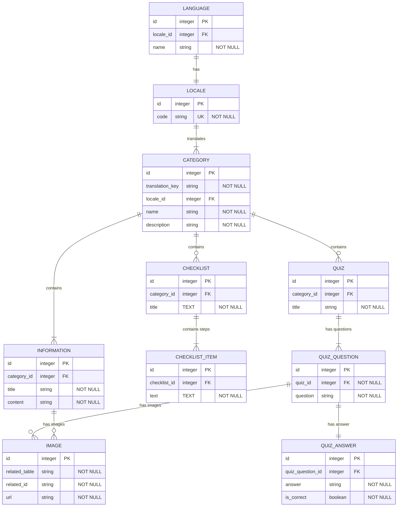

```mermaid
erDiagram
  LANGUAGE ||--|| LOCALE : "has"
  LOCALE ||--|{ CATEGORY : "translates"

  CATEGORY ||--|{ INFORMATION : "contains"
  CATEGORY ||--o{ CHECKLIST  : "contains"
  CHECKLIST ||--|{ CHECKLIST_ITEM  : "contains steps"

  CATEGORY ||--o{ QUIZ : "contains"
  QUIZ ||--|{ QUIZ_QUESTION : "has questions"
  QUIZ_QUESTION ||--|| QUIZ_ANSWER : "has answer"

  QUIZ_QUESTION ||--o{ IMAGE : "has images"
  INFORMATION ||--o{ IMAGE : "has images"

  LOCALE {
    id integer PK
    code string UK "NOT NULL"
  }

  LANGUAGE {
    id integer PK 
    locale_id integer FK
    name string "NOT NULL"
  }

  CATEGORY {
    id integer PK 
    translation_key string "NOT NULL"
    locale_id integer FK
    name string "NOT NULL"
    description string "NOT NULL"
  }

  INFORMATION {
    id integer PK 
    category_id integer FK 
    title string "NOT NULL"
    content string "NOT NULL"
  }

  CHECKLIST {
    id integer PK 
    category_id integer FK            
    title TEXT "NOT NULL"    
  }

  CHECKLIST_ITEM {
    id integer PK
    checklist_id integer FK 
    text TEXT "NOT NULL"             
  }

  QUIZ {
    id integer PK 
    category_id integer FK 
    title string "NOT NULL"
  }

  QUIZ_QUESTION {
    id integer PK
    quiz_id integer FK "NOT NULL"
    question string "NOT NULL"
  }

  QUIZ_ANSWER {
    id integer PK
    quiz_question_id integer FK
    answer string "NOT NULL"
    is_correct boolean "NOT NULL"
  }

  IMAGE {
    id integer PK
    related_table string "NOT NULL"
    related_id string "NOT NULL"      
    url string "NOT NULL"          
  }
```

